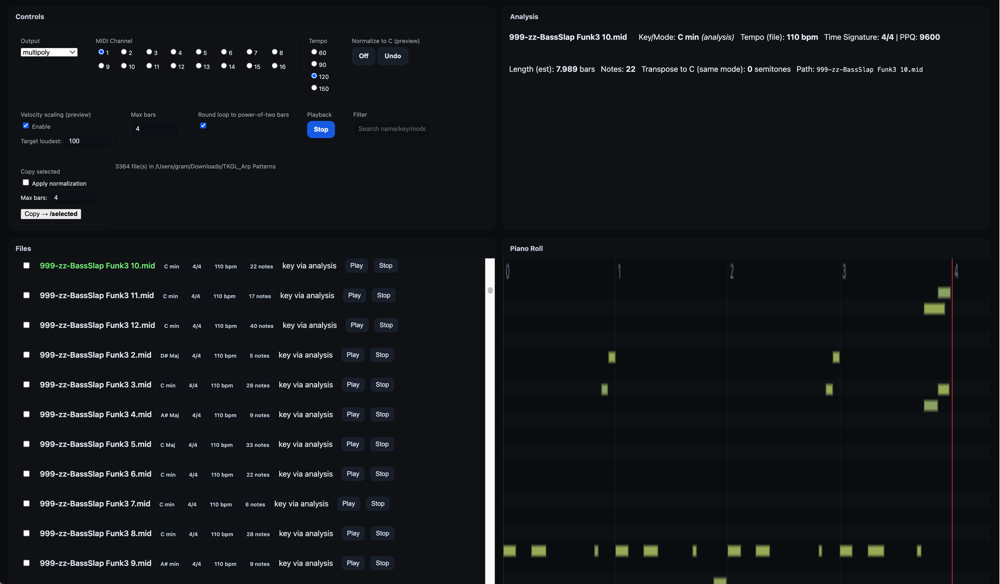

# WebMIDI Clip Manager

Preview, analyze, audition, and export MIDI clips directly in your browser with **WebMIDI**.  
Great for curating arps/phrases for Yamaha Montage/MODX, MPC, and other samplers/keyboards.



---

## Highlights
- **WebMIDI preview** with device selection or a **built‑in synth**.
- **Chord detection** (triads, 7ths, sus, dim/aug) with **labels on the piano roll** and optional **filename tagging** on export.
- **Normalize to C** (keep mode), **velocity scaling** (single control; default on), **max bars** truncation, and **round loop to power‑of‑two** (for clean looping).
- Vector **piano roll** with note names, live play‑head, and active note highlighting.
- **Yamaha‑friendly** export options: force **480 PPQN**, warn on **>16 unique pitches** (arpeggio limit).
- One‑click **Copy to `/selected`**, **ZIP download**, and a **Pack 4** utility to build Montage‑style multi‑track arps.

---

## Requirements
- **Python 3.9+** with `flask` and `mido`:
  ```bash
  pip install flask mido
  ```
- A modern browser with **WebMIDI** (Chrome/Edge recommended). Safari requires enabling WebMIDI in Experimental Features; Firefox does not support WebMIDI without extensions.

---

## Run
```bash
python webmidi_clip_manager.py --root "/path/to/your/midis" --port 8765
```
Then open `http://127.0.0.1:8765` in your browser.

---

## Layout (4 quadrants)
- **Top‑left — Controls**  
  Output device (or *Built‑in Synth*), **MIDI Channel** (dropdown), **Tempo (BPM)** numeric field, export actions, and status.
- **Top‑right — Analysis**  
  Two‑column key/value summary for the currently selected/playing file.
- **Bottom‑left — Files**  
  Scrollable list of clips. **Filter** field lives in this panel’s **header (right side)**. Each row shows tags (tempo, time sig, notes, unique pitches, class, key/mode) and has **Play/Stop** buttons and a selection checkbox.
- **Bottom‑right — Piano Roll**  
  Vector roll with note names on the left, adaptive vertical scaling (more space for small ranges), **chord labels along the top**, active note highlights, loop marker, and a synchronized **play head**.

A floating **Stop All** button sits at the bottom‑right of the page (sends All‑Notes‑Off and silences the built‑in synth).

---

## Controls & Preview
- **Output** – Choose a MIDI device or **Built‑in Synth**.  
- **MIDI Channel** – Dropdown 1–16.  
- **Tempo (BPM)** – Numeric field (default **120**). Changing it restarts the current loop at the new tempo.  
- **Preview settings**
  - **Normalize to C (same mode)** – Transposes detected key to **C** without changing mode (e.g., D Dorian → C Dorian).
  - **Round loop to power‑of‑two bars** – Extends the loop to 1, 2, 4, 8… bars so playback doesn’t cut early.
  - **Max bars** – Truncate preview/export to this many bars.
  - **Velocity scaling** – Enabled by default. Scales velocities so the **loudest note becomes the target** (`Target loudest`, default **100**). Others scale proportionally.

> **Chord inference** runs on the **previewed** notes (post‑transpose/truncate). Labels are placed per beat and repeated labels are collapsed.

---

## Files Pane
- **Filter** matches filename, key/mode, time signature, BPM, and classification.  
- Pills:  
  - `>16 unique` – more than 16 unique pitch classes (Yamaha arp limit).  
  - `Suggest: Fixed` – uses channel 10 (drums).  
  - Time signature, BPM, total notes, unique pitches, classification (`Rhythmic`, `Mono`, `Poly`), and key/mode.
- Click the **name** or **Play** to audition; click **Stop** or use **Stop All**.

---

## Analysis Pane
Two‑column key/value format:
- File
- Key / Mode (and source: filename or analysis)
- Tempo (file)
- Time Sig / PPQ
- Length (estimated bars)
- Notes / Unique (with `>16 unique` warning)
- Max Poly / Class
- Channels (with drum hint)
- Transpose → C (semitones)

---

## Exporting
- **Normalize using preview settings** – Applies **current preview transforms** on export: transpose‑to‑C, max bars, and velocity scaling.
- **Force 480 PPQN (Yamaha)** – Resamples ticks to 480 for better compatibility.
- **Add chord progression to filename** – If enabled, the detected progression (from the current preview) is appended as `Chords=...`. It’s sanitized and length‑limited.
- **Copy → `/selected`** – Writes processed MIDIs to `selected/` next to your root.
- **Download ZIP** – Same as copy but returns a zip.
- **Pack 4 tracks (Yamaha)** – Builds a single type‑1 MIDI with up to 4 selected clips as separate tracks. Honors Normalize and Max bars.

### Filename Tags
Exports automatically add informative tags when applicable, e.g.:
```
My Groove - C Dor max4bar Poly OrgRoot=C VelMax=100 Chords=Cm-Fm-G7.mid
```
Tags are short and order‑stable; chord tag is only added when chord detection produces a result and the export checkbox is on.

---

## Classification & Yamaha Notes
- **Rhythmic (single‑note)** – Only one pitch class is used.
- **Monophonic melodic** – At most one note at a time.
- **Polyphonic/chordal** – Chords or overlapping notes.
- **`>16 unique`** indicates more than 16 distinct pitch classes are present. Yamaha arpeggios typically allow **up to 16 different notes** per arp. Consider simplifying or enabling **Normalize to C** to reduce accidental enharmonics.

---

## Troubleshooting
- **No sound** – Choose an **Output** (or use Built‑in Synth) and ensure your OS/browser grants MIDI/audio permissions.
- **Hanging notes** – Click the floating **Stop All**.
- **Tempo feels wrong** – Check the **Tempo (BPM)** field; previews rescale timing relative to the clip’s original tempo.
- **Playhead/notes misaligned** – The app derives playhead offsets from the same gutter & header metrics as the note renderer. If you still see drift, try reducing CPU load or close heavy tabs.
- **WebMIDI missing** – Use Chrome/Edge, or enable WebMIDI in Safari’s Develop → Experimental Features.

---

## Changelog
- **2025‑08‑10**
  - Moved **Filter** to **Files** header (right).
  - Replaced tempo radio buttons with **Tempo (BPM)** numeric input (default 120).
  - Removed duplicated **Stop All** from Controls panel (kept floating button).
  - Preserved: two‑column Analysis, piano roll improvements, chord labels, velocity scaling (single control), Normalize‑to‑C & power‑of‑two defaults.

---
