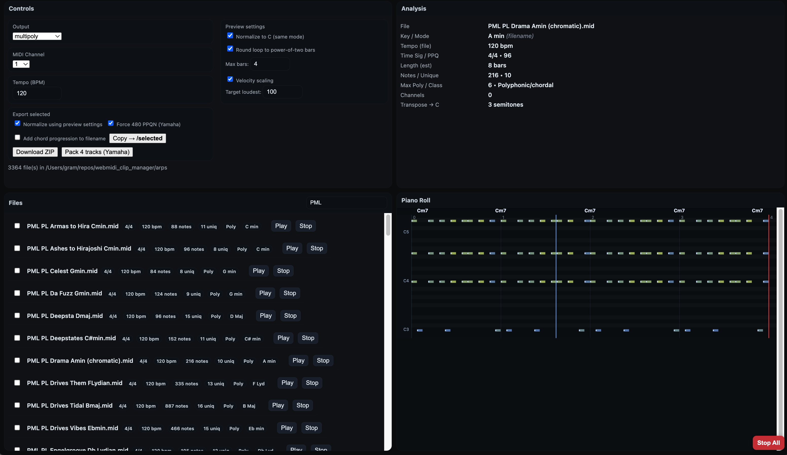

# WebMIDI Clip Manager

A tiny local web app to **audition MIDI loops in your browser**, analyze basic theory info, and **collect a subset** for your MPC or other workflow.

- Preview via **WebMIDI** (hardware synth) **or Built‑in Synth** (WebAudio).
- Loop playback with **tempo**, **channel**, **normalize‑to‑C**, **velocity scaling**, and **max bars**.
- One‑click **copy selected** to a `selected/` subfolder, with optional **normalization** and **bar‑length truncation**.
- Inline **piano roll** and **analysis** panel.
  


---

## Features

- **WebMIDI + Built‑in Synth**
  - Choose any available MIDI output *or* use the built‑in WebAudio synth for quick auditioning.
- **Tempo control** (60/90/120/150 BPM) — preview playback time is correctly scaled (60 is slower than 120).
- **MIDI channel** selector in a compact **2×8 grid**.
- **Normalize to C (preview)** — transposes notes during preview so the detected/declared root becomes **C** (mode preserved).
  - To bake normalization into files, check **“Apply normalization when copying.”**
- **Velocity scaling (preview)** — enable the toggle and set **Target loudest** (1–127). The **loudest** note maps to that value; others are **scaled proportionally**.
- **Max bars**
  - **Preview** truncates playback to the chosen number of bars (computed at the **current preview tempo**).
  - **Copy** truncates exported files to the same number of bars (computed from the file’s time signature).
- **Round loop to power‑of‑two bars** (preview) — pads loop length to 1/2/4/8… bars to avoid early loop points when previewing.
- **Piano roll** — shows note lanes, bar grid, velocity‑tinted notes, and the loop end (red line).
- **Filter & selection** — search by name/key/mode; check multiple files and copy them in one shot.

---

## Requirements

- **Python 3.8+**
- Python packages:
  ```bash
  pip install flask mido
  ```
- Browser: **Chrome** or **Edge** (WebMIDI support). Firefox requires flags and is not recommended here.

> The server never touches your MIDI ports; WebMIDI is entirely in your browser.

---

## Quick Start

1. Put `webmidi_clip_manager.py` somewhere handy.
2. Run it pointing at your MIDI folder:
   ```bash
   python webmidi_clip_manager.py --root "/path/to/your/midis" --port 8765
   ```
3. Open **http://localhost:8765** in Chrome/Edge.
4. If you’ll use hardware MIDI, **allow MIDI access** when prompted and choose your device from **Output**;
   or pick **Built‑in Synth**.

---

## UI Guide

### Controls (Top‑Left)

- **Output** — pick **Built‑in Synth** or any WebMIDI output.
- **MIDI Channel** — 1–16 in a compact 2×8 grid.
- **Tempo** — 60 / 90 / 120 / 150 BPM (preview only; scales time correctly).
- **Normalize to C (preview)** — toggle + **Undo**.
  - Baked‑in normalization is available via **Copy → Apply normalization**.
- **Velocity scaling (preview)** — toggle + **Target loudest** (default 100).
  - Loudest preview velocity becomes the target; others scale proportionally.
  - *Note: velocity scaling affects preview only (not the exported files).*  
- **Max bars**
  - **Preview**: truncates loop length to this many bars at the **current preview tempo**.
  - **Copy**: exported file is cut to this many bars (based on its time signature).
- **Round loop to power‑of‑two bars (preview)** — extends preview loop length to the next 1/2/4/8… bar boundary.
- **Stop** — sends All Notes Off (or kills synth voices).
- **Filter** — quick text filter across name/key/mode/tempo.
- **Copy selected → `selected/`**
  - **Apply normalization** — writes a transposed copy (root→C, same mode).
  - **Max bars** — truncates exports to this length.

### Analysis (Top‑Right)

Shows the file’s **key/mode** (from **filename** when present; else via simple major/minor analysis), **tempo**, **time signature**, **PPQ**, **estimated bars**, **note count**, and the semitone shift needed to **transpose to C** for the same mode.

> Filename parsing recognizes forms like `Cmin`, `Dmaj`, `Gb Lydian`, `F# Dorian`, etc.  
> Analysis fallback is a basic major/minor key guess (Krumhansl‑Schmuckler style profile).

### Files (Bottom‑Left)

- Scrollable list of `.mid` files (recursively found under `--root`).
- Click a name or **Play** to audition; use **Stop** to end.
- Tick the checkbox to include in the export batch.

### Piano Roll (Bottom‑Right)

- Bar grid, velocity‑tinted note blocks, and a red loop‑end marker.
- Reflects **preview** transforms (tempo scaling, normalization, velocity scaling, max‑bars limit, p2 rounding).

---

## Export Details

- Copies go into `selected/` under your `--root` folder.
- **Apply normalization**: transposes note numbers only; timing and velocities are preserved.
- **Max bars**: trims events beyond the bar boundary and closes any sustained notes at the boundary.

> Export does **not** apply velocity scaling — it’s for preview only (by design).  
> Want it baked into exports? Open an issue/ask and we’ll add an option.

---

## Tips & Troubleshooting

- **No sound?**
  - Using WebMIDI: confirm your device is selected and the browser has WebMIDI permission.
  - Using Built‑in Synth: it’s a simple sawtooth; turn down your speakers 🙃
- **Tempo feels off** — preview rescaling uses `scale = original_bpm / selected_bpm` so 60 plays **slower** than 120.
- **Stuck notes** — hit **Stop**; it sends All Notes Off / kills synth voices.
- **Firefox** — WebMIDI is disabled by default; use Chrome/Edge for best results.
- **Very long files** — use **Max bars** + **Round loop to power‑of‑two** in preview to keep loops tidy, and set **Max bars** for export.

---

## Command‑Line Reference

```
usage: webmidi_clip_manager.py --root PATH [--port PORT]

--root   Root folder containing .mid files (scanned recursively)
--port   HTTP port (default 8765)
```

---

## Security & Privacy

- Runs **entirely locally**; files are served from your machine and are not uploaded.
- WebMIDI permissions are handled by your browser.

---

## Roadmap / Ideas

- Optional **ZIP export** for the selected set.
- Option to **apply velocity scaling** to the exported files.
- Per‑file preview **transpose slider**.
- Built‑in **GM‑style** synth voices.


